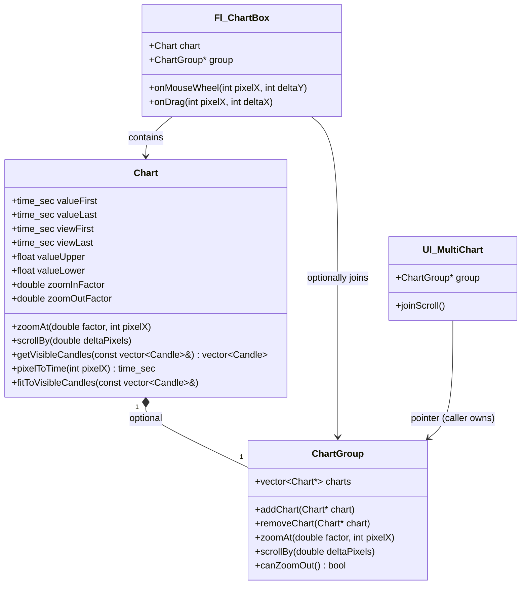

# TODO: Chart Zoom/Scroll Implementation Plan

## Overview

Implementation of horizontal zoom and scroll functionality for the chart system with optional multi-chart synchronization.

## Requirements Summary

- **X-axis Zoom**: Center sticks to chart edges in first/last quarter, otherwise center is visible area middle
- **Y-axis**: Auto-fit to visible data only (not all data)
- **Scroll**: Click and drag horizontally - chart follows mouse pointer (mobile-style)
- **Multi-chart**: Optionally joinable (linked X values)

---

## Current State (Partial Implementation)

### Existing Infrastructure

1. **Fl_CanvasBox** ([`cpptools/misc/Fl_CanvasBox.hpp`](cpptools/misc/Fl_CanvasBox.hpp)):
   - Mouse event handling already implemented (push, release, drag, scroll, move, enter, leave)
   - Event coordinates converted to canvas space
   - Callbacks via `std::function` members in Canvas interface
   - **Note**: Fl_CanvasBox is canvas-agnostic, knows nothing about charts

2. **Canvas Callbacks** ([`cpptools/misc/Canvas.hpp`](cpptools/misc/Canvas.hpp:25)):
   ```cpp
   function<void(int left, int top, int button)> push = nullptr;
   function<void(int left, int top, int button)> release = nullptr;
   function<void(int left, int top, int button)> drag = nullptr;      // For scroll-by-drag
   function<void(int left, int top, int delta_x, int delta_y, int button)> scroll = nullptr;  // For mouse wheel
   ```

3. **UI_MultiChart::joinScroll()** ([`cpptools/grph/UI.hpp`](cpptools/grph/UI.hpp:405)) - **HAS TODO**:
   ```cpp
   void joinScroll() {
       int chartno = 0;
       for (UI_ChartBox* chartBox: chartBoxes) {
           chartBox->flchart()->scroll = [chartno, chartBox](int /*left*/, int /*top*/, int /*delta_x*/, int /*delta_y*/, int /*button*/) {
               DBG("TODO zoom all! " + to_string(chartno));  // <-- NOT IMPLEMENTED
           };
           chartno++;
       }
   }
   ```

### What's Missing

1. **Chart class** has no view window management
2. No zoomAt() or scrollBy() methods in Chart
3. No pixelToTime() conversion
4. No ChartGroup class for synchronization
5. Fl_ChartBox not connected to Chart zoom/scroll methods
6. No getVisibleCandles() / getVisiblePoints() filtering
7. Y-axis should fit to visible data only (not all data)
8. Mouse wheel zoom not connected
9. Drag scroll not connected

---

## Architecture



---

## Implementation Steps

### Phase 1: Core Chart View Management

#### 1.1 Add View Window Members to Chart

**File**: `cpptools/grph/Chart.hpp`

```cpp
// Add view window members (keep valueFirst/valueLast for backward compatibility):
time_sec viewFirst;      // Visible window start
time_sec viewLast;       // Visible window end

// Zoom configuration (configurable via constructor)
double zoomInFactor = 1.25;   // Scroll up = zoom in
double zoomOutFactor = 0.8;   // Scroll down = zoom out
```

#### 1.2 Add View Management Methods to Chart

**File**: `cpptools/grph/Chart.hpp`

```cpp
// Get visible subset of data
vector<Candle> getVisibleCandles(const vector<Candle>& candles) const;
vector<TimePoint> getVisiblePoints(const vector<TimePoint>& points) const;

// Coordinate conversion with view window
int timeToX(time_sec time) const override;  // Use view window
time_sec pixelToTime(int pixelX) const;

// Fit Y-axis to visible data (called after filtering visible data)
void fitToVisibleCandles(const vector<Candle>& candles);
void fitToVisiblePoints(const vector<TimePoint>& points);

// Reset view to full data range
void resetView() {
    viewFirst = valueFirst;
    viewLast = valueLast;
}

// Check if any data is outside visible view
bool hasDataOutsideView() const {
    return valueFirst < viewFirst || valueLast > viewLast;
}
```

#### 1.3 Implement Zoom Logic (Simple)

**File**: `cpptools/grph/Chart.hpp`

```cpp
// Zoom at pixel position (1.0 = no change, >1 = zoom in, <1 = zoom out)
void zoomAt(double factor, int pixelX) {
    time_sec visibleDuration = viewLast - viewFirst;
    time_sec newDuration = visibleDuration / factor;
    
    // Clamp to data boundaries - max zoom out when all data is visible
    time_sec dataDuration = valueLast - valueFirst;
    if (newDuration > dataDuration) newDuration = dataDuration;
    
    // Calculate relative X position (0.0 to 1.0)
    double relativeX = (double)(pixelX - spacingLeft) / innerWidth();
    
    // Edge quarter logic: stick to edges
    if (relativeX < 0.25) {
        // Stick to left edge
        viewFirst = valueFirst;
        viewLast = viewFirst + newDuration;
    } else if (relativeX > 0.75) {
        // Stick to right edge
        viewLast = valueLast;
        viewFirst = viewLast - newDuration;
    } else {
        // Center on pixel position
        time_sec centerTime = valueFirst + relativeX * dataDuration;
        viewFirst = centerTime - newDuration * relativeX;
        viewLast = viewFirst + newDuration;
        
        // Clamp to data boundaries
        if (viewFirst < valueFirst) {
            viewFirst = valueFirst;
            viewLast = viewFirst + newDuration;
        }
        if (viewLast > valueLast) {
            viewLast = valueLast;
            viewFirst = viewLast - newDuration;
        }
    }
}
```

#### 1.4 Implement Scroll Logic

**File**: `cpptools/grph/Chart.hpp`

```cpp
// Scroll by delta in pixels (mobile-style: drag left moves chart right)
// Chart moves in real-time as mouse moves
void scrollBy(double deltaPixels) {
    if (valueLast <= valueFirst) return;
    
    // Calculate seconds per pixel based on FULL data range
    double secondsPerPixel = (double)(valueLast - valueFirst) / innerWidth();
    time_sec deltaTime = (time_sec)(deltaPixels * secondsPerPixel);
    
    viewFirst += deltaTime;
    viewLast += deltaTime;
    
    // Clamp to data boundaries
    if (viewFirst < valueFirst) {
        viewFirst = valueFirst;
    }
    if (viewLast > valueLast) {
        viewLast = valueLast;
    }
}
```

#### 1.5 Implement Y-Axis Fit to Visible Data

**File**: `cpptools/grph/Chart.hpp`

```cpp
// Fit Y-axis to visible candles only
void fitToVisibleCandles(const vector<Candle>& candles) {
    valueLower = numeric_limits<float>::infinity();
    valueUpper = -numeric_limits<float>::infinity();
    
    for (const Candle& candle : candles) {
        const float candleLow = candle.getLow();
        if (isnan(candleLow)) continue;
        const float candleHigh = candle.getHigh();
        if (isnan(candleHigh)) continue;
        
        valueLower = candleLow < valueLower ? candleLow : valueLower;
        valueUpper = candleHigh > valueUpper ? candleHigh : valueUpper;
    }
}

// Similar for fitToVisiblePoints
```

---

### Phase 2: Multi-Chart Synchronization

#### 2.1 Create ChartGroup Class

**File**: `cpptools/grph/ChartGroup.hpp`

```cpp
#pragma once

#include <vector>
#include <algorithm>

using namespace std;

class Chart;

class ChartGroup {
public:
    void addChart(Chart* chart) {
        if (chart && find(charts.begin(), charts.end(), chart) == charts.end()) {
            charts.push_back(chart);
        }
    }
    
    void removeChart(Chart* chart) {
        charts.erase(remove(charts.begin(), charts.end(), chart), charts.end());
    }
    
    void zoomAt(double factor, int pixelX) {
        // Check if we can zoom out (any chart has data outside view)
        if (factor < 1.0 && !canZoomOut()) return;
        
        for (Chart* chart : charts) {
            chart->zoomAt(factor, pixelX);
        }
    }
    
    void scrollBy(double deltaPixels) {
        for (Chart* chart : charts) {
            chart->scrollBy(deltaPixels);
        }
    }
    
    // Check if any chart has data outside current view
    bool canZoomOut() const {
        for (const Chart* chart : charts) {
            if (chart->hasDataOutsideView()) return true;
        }
        return false;
    }
    
private:
    vector<Chart*> charts;
};
```

---

### Phase 3: Fl_ChartBox Integration

#### 3.1 Add Mouse Event Handlers to Fl_ChartBox

**File**: `cpptools/grph/Fl_ChartBox.hpp`

```cpp
// Add to public section:
void setChartGroup(ChartGroup* group) { this->group = group; }

// Add constructor initialization:
Fl_ChartBox(...):
    Fl_CanvasBox(X, Y, W, H),
    chart(*static_cast<Canvas*>(this), ...)
{
    // Set up mouse wheel callback for zoom
    canvas.scroll = [this](int left, int top, int dx, int dy, int button) {
        if (dy != 0) {
            onMouseWheel(left, dy);
        }
    };
    
    // Set up drag callback for scroll (real-time as mouse moves)
    canvas.drag = [this](int left, int top, int button) {
        static int lastX = 0;
        if (lastX != 0) {
            onDrag(left, left - lastX);
        }
        lastX = left;
    };
    
    // Reset drag tracking on push
    canvas.push = [this](int left, int top, int button) {
        lastDragX = left;
    };
}

// Add protected methods:
protected:
    void onMouseWheel(int pixelX, int deltaY) {
        double factor = deltaY > 0 ? chart.zoomInFactor : chart.zoomOutFactor;
        
        if (group) {
            group->zoomAt(factor, pixelX);
        } else {
            chart.zoomAt(factor, pixelX);
        }
        redraw();
    }
    
    void onDrag(int pixelX, int deltaX) {
        if (group) {
            group->scrollBy(deltaX);
        } else {
            chart.scrollBy(deltaX);
        }
        redraw();
        lastDragX = pixelX;
    }
    
    ChartGroup* group = nullptr;
    int lastDragX = 0;
```

---

### Phase 4: Complete UI_MultiChart::joinScroll()

**File**: `cpptools/grph/UI.hpp`

```cpp
void joinScroll() {
    ChartGroup* group = new ChartGroup();
    
    // Add all charts to the group
    for (UI_ChartBox* chartBox : chartBoxes) {
        group->addChart(&chartBox->flchart()->chart);
    }
    
    // Set up synchronized scroll/zoom
    for (UI_ChartBox* chartBox : chartBoxes) {
        Fl_ChartBox* flChart = chartBox->flchart();
        flChart->setChartGroup(group);
    }
    
    // Note: Caller is responsible for ensuring ChartGroup lifetime exceeds all Fl_ChartBox instances
}
```

---

### Phase 5: Update Drawing to Use View Window

#### 5.1 Modify Fl_ChartBox::draw()

**File**: `cpptools/grph/Fl_ChartBox.hpp`

```cpp
void draw() override {
    Fl_CanvasBox::draw();
    
    size_t panes = max({ 
        candlesSerieses.size(), 
        barsSerieses.size(),
        pointsSerieses.size(),
    });
    
    for (size_t pane = 0; pane < panes; pane++) {
        const vector<CandleSeries>& candlesSeries = candlesSerieses.size() > pane ? candlesSerieses[pane] : vector<CandleSeries>();
        const vector<TimePointSeries>& barsSeries = barsSerieses.size() > pane ? barsSerieses[pane] : vector<TimePointSeries>();
        const vector<TimePointSeries>& pointsSeries = pointsSerieses.size() > pane ? pointsSerieses[pane] : vector<TimePointSeries>();
        
        // Reset chart bounds
        chart.resetBounds();
        
        // First pass: fit to full data (for valueFirst/valueLast)
        for (const CandleSeries& candleSeries : candlesSeries)
            chart.fitToCandles(candleSeries.getCandlesCRef());
        for (const TimePointSeries& barSeries : barsSeries)
            chart.fitToPoints(barSeries.getPointsCRef());
        for (const TimePointSeries& pointSeries : pointsSeries)
            chart.fitToPoints(pointSeries.getPointsCRef());
        
        // Initialize view if not set
        if (chart.viewFirst == 0 && chart.viewLast == 0) {
            chart.resetView();
        }
        
        // Second pass: get visible data and fit Y-axis to visible
        for (const CandleSeries& candleSeries : candlesSeries) {
            vector<Candle> visibleCandles = chart.getVisibleCandles(candleSeries.getCandlesCRef());
            chart.fitToVisibleCandles(visibleCandles);
        }
        // Similar for bars and points
        
        // Draw visible data
        for (const CandleSeries& candleSeries : candlesSeries) {
            vector<Candle> visibleCandles = chart.getVisibleCandles(candleSeries.getCandlesCRef());
            chart.showCandles(visibleCandles, ...);
        }
        // Similar for bars and points
    }
}
```

---

### Phase 6: Testing

#### 6.1 Add Tests from cpptools/grph/tests/TODO.md

Implement the tests listed in the existing TODO.md file:
- View management tests
- Zoom tests (edge quarters, clamping)
- Scroll tests (boundary clamping)
- Coordinate conversion tests
- Integration tests
- Fl_ChartBox mouse callback tests
- ChartGroup synchronization tests

---

## Configuration Constants

```cpp
// Default zoom factors (configurable per chart)
const double CHART_ZOOM_IN_FACTOR = 1.25;
const double CHART_ZOOM_OUT_FACTOR = 0.8;

// No minimum zoom duration - users can zoom in forever
// Maximum zoom out = when all charts show all their data
```

---

## Files to Modify/Create

| File | Action | Status |
|------|--------|--------|
| `cpptools/grph/Chart.hpp` | Modify - add view management | Pending |
| `cpptools/grph/ChartGroup.hpp` | Create - synchronization class | Pending |
| `cpptools/grph/Fl_ChartBox.hpp` | Modify - mouse event handlers, draw with filtering | Pending |
| `cpptools/grph/UI.hpp` | Modify - implement joinScroll() | Pending |
| `cpptools/grph/tests/test_Chart.hpp` | Add zoom/scroll tests | Pending |
| `cpptools/grph/tests/test_Fl_ChartBox.hpp` | Add mouse event tests | Pending |
| `cpptools/grph/tests/TODO.md` | Update - mark implemented tests | Pending |

---

## Backward Compatibility

- Keep existing `valueFirst`/`valueLast` member names (no rename)
- `fitToCandles()` and `fitToPoints()` remain for setting full data range
- `showCandles()`, `showBars()`, `showPoints()` updated to use view window
- New methods follow naming conventions (gamelCase for class methods)

---

## Notes

1. **Fl_CanvasBox abstraction**: Canvas knows nothing about charts - callbacks are just function pointers
2. **Scroll behavior**: Mobile-style - chart follows mouse pointer in real-time
3. **Zoom limits**: No minimum zoom, maximum zoom when all data is visible across all joined charts
4. **Y-axis**: Fits to visible data only, calculated per chart independently
5. **Naming**: Follows coding conventions (gamelCase for class methods)
6. **Drag tracking**: Reset on FL_PUSH, calculate delta in real-time during FL_DRAG
7. **Zoom factors**: Configurable via constructor parameters with defaults 1.25/0.8
8. **Memory**: ChartGroup heap-allocated, caller responsible for lifetime
